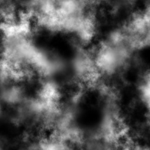

## Terran render project

This is the first homework of the computer graphics course. In this project, I will render the Terran by OpenGL. The input height map is a gray scale image, and each pixel of the image stand for the height of the Terran. 

For example, given the following input:

The rendering result is:

Environment for this project:

- Windows OS

- visual studio 2017 or higher version

External library:

- GLUT: create the window
- GLEW: for OpenGL

- GLM: OpenGL Mathematics  library
- jpeg: for loading the height map

Keyboard and mouse control:

- Drag mouse:
  - Drag mouse left button: rotate the model along x or y axis
  - Drag mouse middle button: rotate the model along z axis
- Control + drag mouse:
  - Control + drag mouse left button: translate the model along x or y axis
  - Control + drag mouse middle button:  translate the model along z axis
- Shift + drag mouse:
  - Shift+ drag mouse left button: scale the model along x or y axis
  - Shift+ drag mouse middle button:  scale the model along z axis
- Keyboard action:
  - press key 1: point cloud mode, the model rendered as point cloud
  - press key 2: line mode, the model rendered as line
  - press key 3: triangle mesh mode, the model rendered as triangle mesh. This is the default option
  - press key 4: smooth triangle mesh mode, the model become smooth
  - press key 5: background image mode, the model will use a given background image as texture

How to use?

1. Click TerranRender.sln to run the source project
2. The demonstration folder show the rendering image
3. The release folder has the compiled version of the project. To run the program, you need to provide one parameter as the input height map path. You can also click render.bat to start the demo
4. The Bin folder contain the output of visual studio. Mind that this program need glew32.dll and freeglut.dll, so you need to put this two files into the folder that contain output the exe file.

